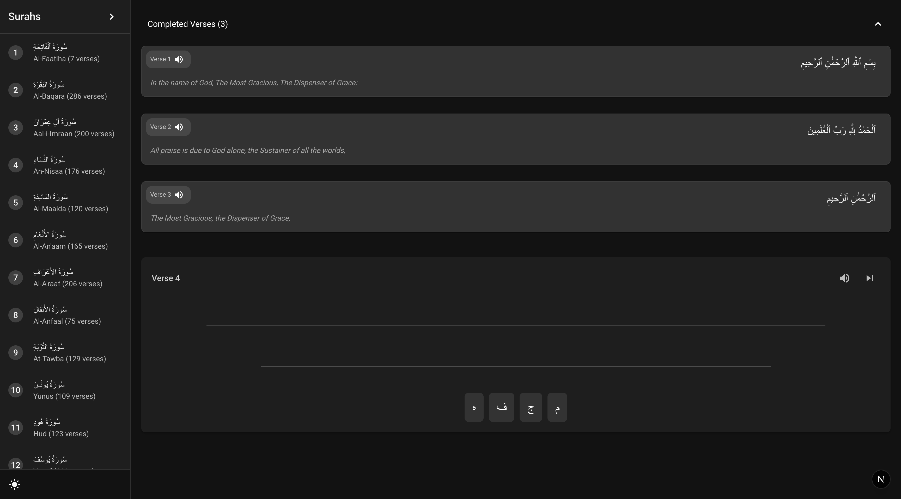

# HuroofHub - Arabic Writing Practice

HuroofHub is an interactive web application designed to help users practice Arabic writing. This guide will walk you through the process of setting up and running the application on your local machine, even if you're not familiar with web development.



## Table of Contents

- [Prerequisites](#prerequisites)
- [Installation](#installation)
- [Running the Application](#running-the-application)
- [Using HuroofHub](#using-huroofhub)
- [Troubleshooting](#troubleshooting)
- [FAQs](#faqs)

## Prerequisites

Before you begin, you need to install a few tools:

### 1. Install Node.js and npm

Node.js is a JavaScript runtime that allows you to run JavaScript on your computer. npm (Node Package Manager) comes with Node.js and helps manage JavaScript packages.

**For Windows:**

1. Go to [Node.js website](https://nodejs.org/)
2. Download the LTS (Long Term Support) version
3. Run the installer and follow the instructions
4. To verify installation, open Command Prompt and type:

   ```bash
   node -v
   npm -v
   ```

**For macOS:**

1. Go to [Node.js website](https://nodejs.org/)
2. Download the LTS version
3. Run the installer and follow the instructions
4. Alternatively, if you have Homebrew installed, you can run:

   ```bash
   brew install node
   ```

5. To verify installation, open Terminal and type:

   ```bash
   node -v
   npm -v
   ```

**For Linux (Ubuntu/Debian):**

1. Open Terminal
2. Run the following commands:

   ```bash
   sudo apt update
   sudo apt install nodejs npm
   ```

3. Verify installation:

   ```bash
   node -v
   npm -v
   ```

### 2. Install Git (Optional, but recommended)

Git is a version control system that helps manage code changes.

**For Windows:**

1. Go to [Git website](https://git-scm.com/)
2. Download and install Git
3. Use default settings during installation

**For macOS:**

1. If you have Homebrew:

   ```bash
   brew install git
   ```

2. Otherwise, download from [Git website](https://git-scm.com/)

**For Linux:**

```bash
sudo apt install git
```

## Installation

### Step 1: Get the Code

#### Option 1: Using Git (Recommended)

Open Terminal (macOS/Linux) or Command Prompt/PowerShell (Windows) and run:

```bash
git clone https://github.com/asjadaugust/huroofhub.git
cd huroofhub
```

#### Option 2: Download ZIP file

1. Download the project as a ZIP file
2. Extract the ZIP file
3. Open Terminal/Command Prompt
4. Navigate to the extracted folder:

   ```bash
   cd path/to/extracted/huroofhub
   ```

### Step 2: Install Dependencies

Run the following command in Terminal/Command Prompt from the project directory:

```bash
npm install
```

This will install all the necessary packages for the application. It might take a few minutes.

## Running the Application

### Start the Development Server

Run the following command in Terminal/Command Prompt from the project directory:

```bash
npm run dev
```

After running this command, you should see output indicating that the server is running. It will typically show something like:

```bash
ready - started server on 0.0.0.0:3000
```

### Access the Application

Open your web browser and navigate to:

```bash
http://localhost:3000
```

You should now see the HuroofHub application running in your browser!

## Using HuroofHub

### Basic Usage

1. When you first open the application, you'll see an Arabic sentence displayed at the top.
2. Listen to the pronunciation by clicking the speaker icon.
3. Select the correct Arabic characters from the options at the bottom to complete the sentence.
4. If you select an incorrect option, it will turn red.
5. If you select the correct option, it will briefly turn green and then advance to the next letter.
6. Once you complete the sentence, a success message will appear.

### Theme Toggle

You can switch between light and dark mode using the theme toggle button in the application.

## Troubleshooting

### Common Issues and Solutions

#### "npm not recognized" error

- Make sure Node.js and npm are properly installed
- Try restarting your computer
- Check if the PATH environment variable includes the npm directory

#### Application doesn't start

- Make sure you're in the correct directory
- Try running `npm install` again to ensure all dependencies are installed
- Check if the port 3000 is already in use by another application

#### Browser shows "Cannot connect to server"

- Make sure the development server is running
- Check your firewall settings
- Try using a different browser

#### Audio doesn't play

- Make sure your browser supports the Web Speech API
- Check if your browser has permission to use audio
- Try using a different browser (Chrome works best for speech synthesis)

## FAQs

**Q: Do I need to know Arabic to use this application?**
A: No, the application is designed to help you learn Arabic characters and writing.

**Q: Can I use this offline?**
A: Once you've started the application, it should work even with limited internet connectivity, but initial setup requires internet.

**Q: How do I stop the application when I'm done?**
A: In the Terminal/Command Prompt where the application is running, press `Ctrl+C` to stop the server.

**Q: How can I update the application if there are new features?**
A: If you used Git, navigate to the project directory and run:

```bash
git pull
npm install
```

If you downloaded the ZIP, you'll need to download and extract the new version.

---

For more information or technical support, please open an issue on our GitHub repository or contact the development team.
